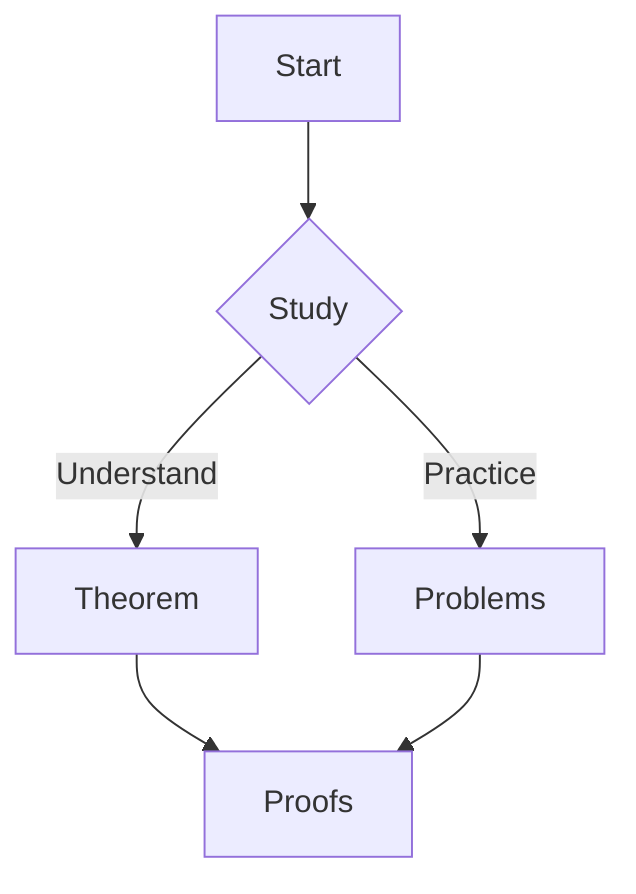

# Math Journal

A fast, polished math journal built with Astro + MDX + KaTeX + Mermaid.

## Features

- **Fast MDX**: Write content in Markdown with React components
- **Math rendering**: KaTeX for beautiful, print-quality math
- **Diagrams**: Mermaid for flowcharts and graphs
- **Sticky TOC**: Auto-generated table of contents
- **Math components**: `<Theorem/>`, `<Lemma/>`, `<Proof/>` blocks
- **Free hosting**: GitHub Pages deployment

## Quick Start

```bash
# Install dependencies
npm install

# Start dev server
npm run dev

# Build for production
npm run build
```

## Writing Math

Use `$...$` for inline math and `$$...$$` for block math:

```mdx
The quadratic formula is $x = \frac{-b \pm \sqrt{b^2 - 4ac}}{2a}$.

$$
\int_{-\infty}^{\infty} e^{-x^2} dx = \sqrt{\pi}
$$
```

## Math Components

```mdx
import Theorem from "../../components/Theorem.astro";
import Lemma from "../../components/Lemma.astro";
import Proof from "../../components/Proof.astro";

<Theorem id="cauchy-schwarz" title="Cauchy–Schwarz">
For all $x,y\in\mathbb{R}^n$, $|\langle x,y\rangle|\le \|x\|\|y\|$.
</Theorem>

<Proof for="cauchy-schwarz">
Apply $0\le\|x-\lambda y\|^2$ and optimize $\lambda=\frac{\langle x,y\rangle}{\|y\|^2}$.
</Proof>
```

## Mermaid Diagrams

```mdx

```

## Deployment

This site is automatically deployed to GitHub Pages on push to `main`.

1. Enable GitHub Pages in your repository settings
2. Set source to "GitHub Actions"
3. Push to `main` branch

Site will be available at: `https://ekino.github.io/math-journal`

## Tech Stack

- **Astro**: Static site generator
- **MDX**: Markdown with components
- **KaTeX**: Math rendering
- **Mermaid**: Diagram rendering
- **Tailwind CSS**: Styling
- **GitHub Pages**: Free hosting
