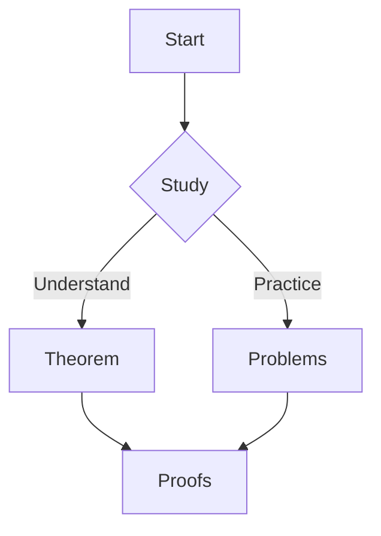

import Theorem from "../../components/Theorem.astro";
import Lemma from "../../components/Lemma.astro";
import Proof from "../../components/Proof.astro";

## Overview

This module page demonstrates math blocks, Mermaid diagrams, and a sticky TOC.

## A mini theorem

<Theorem id="cauchy-schwarz" title="Cauchy–Schwarz">
For all $x,y\\in\\mathbb{R}^n$, $ |\\langle x,y\\rangle|\\le \\|x\\|\\|y\\| $.
</Theorem>

<Proof for="cauchy-schwarz">
Apply $0\\le\\|x-\\lambda y\\|^2$ and optimize $\\lambda=\\frac{\\langle x,y\\rangle}{\\|y\\|^2}$.
</Proof>

<Lemma title="AM–GM (n=2)">
For $a,b\\ge0$, $ \\tfrac{a+b}{2}\\ge\\sqrt{ab}$.
</Lemma>

## Mermaid example

## Resources

- Notes
- Exercises

